// variables
:jdk_version: 11
:keycloak_base_url: http://localhost:8080/
:default_keycloak_user: admin
:default_keycloak_password: change_me
:realm_name: parking-share
:backend_client_id: api
:frontend_client_id: frontend

IMPORTANT: Make sure to use JDK {jdk_version}

This project uses docker compose to quickly set up the environment.
To start keycloak with postgres as it's database start run the following command from the level of the docker-compose.yml file

[source,shell]
----
$ docker-compose up -d
----

=== Login to keycloak

Open {keycloak_base_url} in your browser and click *Administration console*

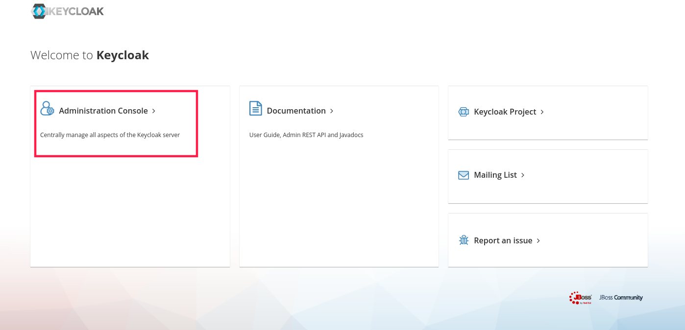

Login using defualt credentials:
[cols="1,1"]
|===
|Login
|{default_keycloak_user}

|Password
|{default_keycloak_password}
|===

WARNING: Default credentials should be used only for local development. For production use please see the production ready guide (TODO: Create production ready guide).

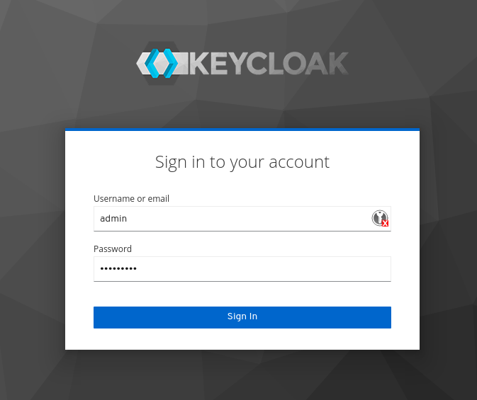

=== Create Realm

Click the dropdown currently indicating that "Master" realm is active and click "Add Realm" button.

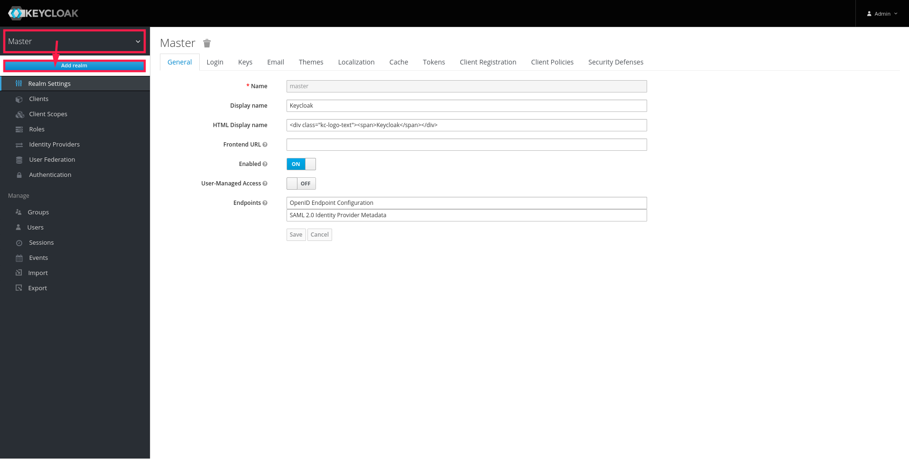

Set realm name to "{realm_name}"
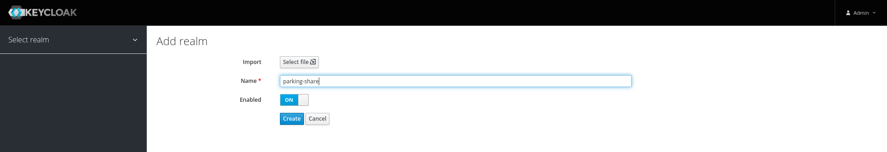

from now on, make sure that "{realm_name}" is active.

=== Create a client for the backend

Client is an entity that will be requesting access to the resources. In our case we need separate client for the frontend application and API.

Select "Clients" option from the menu to the left and then click "Create" button.

Set the following values:
[cols="1,1"]
|===
| Client ID
| {backend_client_id}

| Client Protocol
| openid-connect
|===
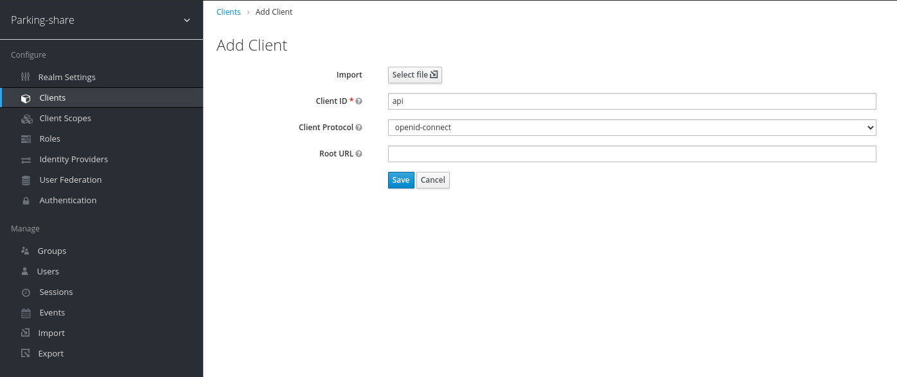

After clicking "Save" in the next menu set the following values:
[cols="1,1"]
|===
| Enabled
| ON

| Access Type
| Bearer only
|===
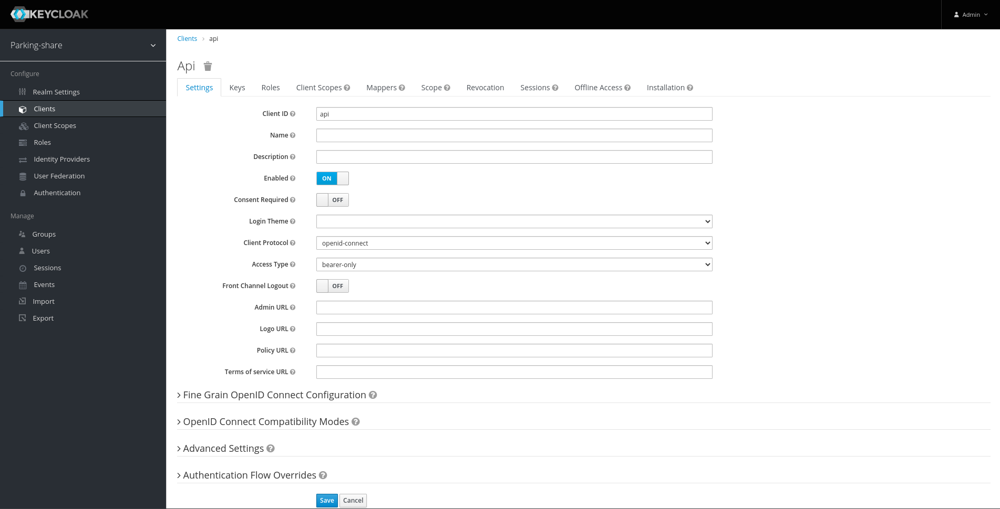
Here access type is set to "bearer only" as API will never initiate login. It will just expect valid bearer token.

Now create roles for the API. Click "Roles" tab and click the "Add Role" button.

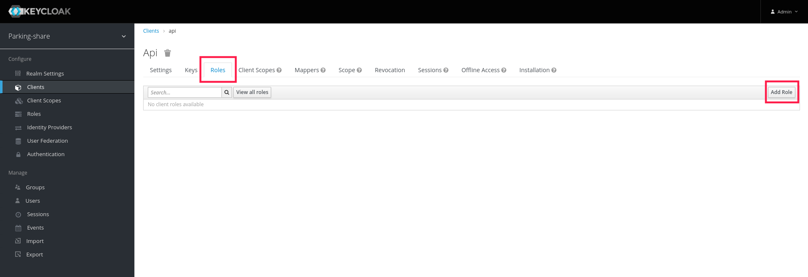

As there are 2 types of users in the scope of this app:

* admin
* user

we will create appropriate roles with the following Role Names

* api_admin
* api_user

=== Create a client for the frontend

Create a new client same as in the previous section and call it: "{frontend_client_id}"
This time we need to make sure, that the configuration is as follows:

[cols="1,1"]
|===
| Client Protocol
| openid-connect

| Access Type
| Public

| Standard Flow Enabled
| On

| Implicit Flow Enabled
| off

| Direct Access Grants Enabled
| off

| Root URL
| http://localhost:4200

| Valid Redirect URIs
| http://localhost:8080/*

http://localhost:4200/*

http://localhost:80/*

http://localhost/*

| Web origins
| +
|===

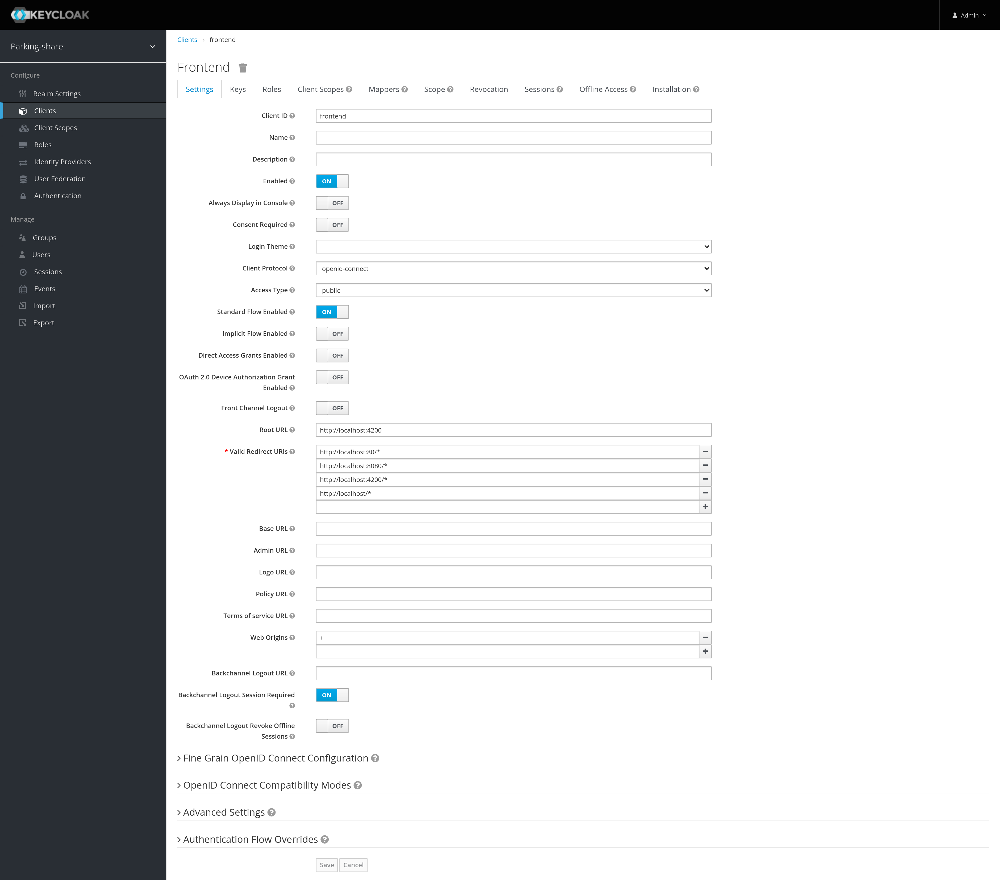

And create composite role for app user

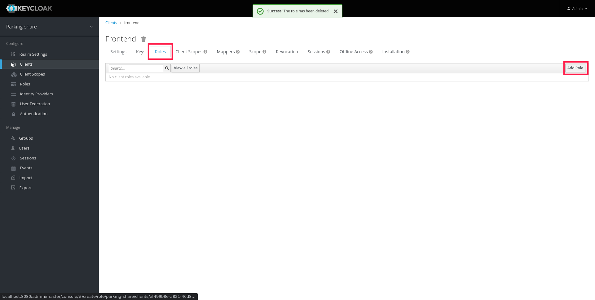

Set "Role Name" to "app_user" and on the next screen set "Composite Roles" to "ON" and then select "api" from the "Client Roles" dropdown. Select "api_user" role and click "Add Selected". From now on every user with the role "app_user" from frontend client will be automatically assigned "api_user" role from api client.

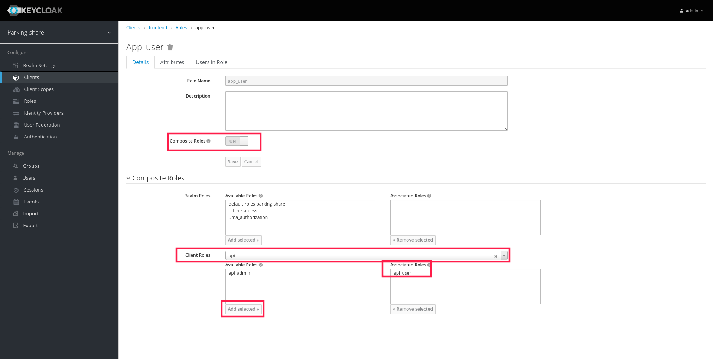

Then analogously we need to create app_admin role, but we will assign both api_user and api_admin as composite roles.

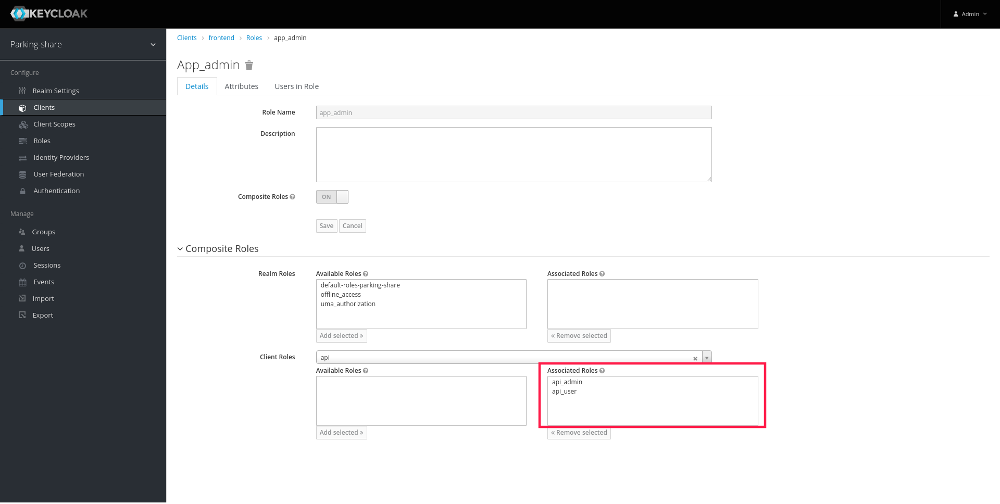
